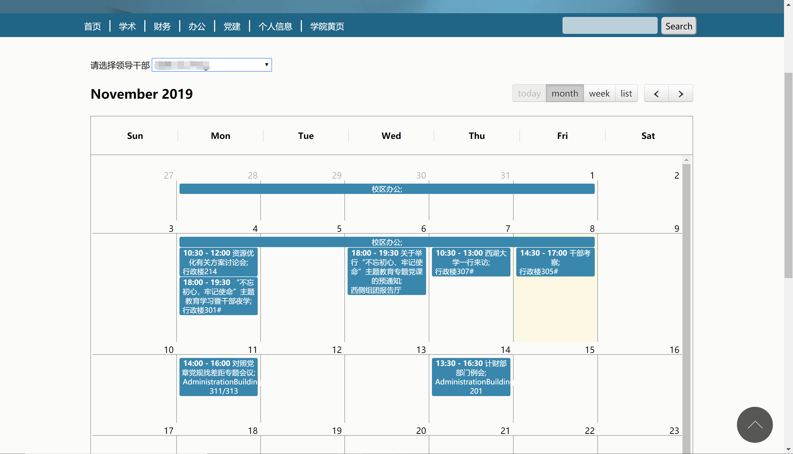

# leaders-calendar
Code that extracts entries from Office 365 Calendar and renders in page using [FullCalendar](https://fullcalendar.io/). You can also switch the manager whose calendar you want to see in the page.
## Screenshot

## Stackoverflow thread
https://stackoverflow.com/a/47259181/1414641
A relevant question on Stackoverflow in which I answered and provided source code derived from the project. It collects as many upvotes as the best answer.
